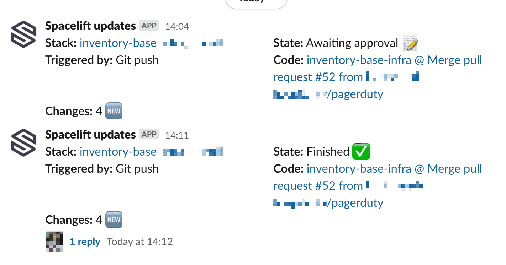

# Spacelift Webhook Receiver

*Spacelift Webhook Receiver* is a service for recieving Spacelift webhook/audit events and notifying channels/users in Slack.



Subscriptions are set up per-stack using `slack:#channel` labels (more details below).

SWR runs in AWS Lambda and is written in Typescript.

## Label Syntax

Label examples:

* `slack:#infra`
* `slack:#infra:finished,failure,unconfirmed`
* `slack:user.name:planning`

Labels are colon `:` delimited.

1. The first section must be `slack`.
2. The second section is the Slack target. You can specify a channel (`#foo`), username (`user.name`), channel ID (`C12345XYZ`), or user ID (`U12345XYZ`). (If you want to specify multiple targets, add one label for each.)
3. The third section is optional. You can specify the run states that will generate notifications. By default, it is `failure`. Comma-separate multiple states.

### Spacelift States

There's no authoritative list of states in Spacelift's docs. The closest you'll find is [the page on run states](https://docs.spacelift.io/concepts/run). Here's an incomplete list for your convenience: `queued`, `preparing`, `initializing`, `planning`, `unconfirmed`, `confirmed`, `applying`, `finished`, `failure`, `destroying`, `performing`.

## Installation

At the moment, deploying this service is quite manual. The high-level process is:

1. Create a Slack app and install it to your workspace
2. Build code
3. Deploy service

### Create a Slack app and install it to your workspace

1. Visit https://api.slack.com/apps and create a new app
2. On "Oauth & Permissions", add the following permissions:
    1. `chat:write.public` (message public channels)
    2. `chat:write` (message private channels the bot is invited to)
    3. `im:write` (DM users)
    4. `users:read` (send messages to user.names)
3. Install the app to your workspace
4. On "Oauth & Permissions", copy the "Bot User OAuth Token" for later
5. On "Basic Information", copy the "Signing Secret" for later

### Build code

```bash
cd app
npm ci
npm run-script build
```

You'll end up with `dist/dist.zip` which contains the Lambda handler.

### Deploy service

There is a Terraform module in `infra/` which can deploy the minimal required AWS resources. See the example usage in `infra/example/`.

Once the service is deployed, you need to add a webhook in Spacelift. There are two ways to do this:

1. Per-stack webhook integration.
2. Global audit webhook. Make sure to enable "Include runs".

There's no difference in functionality between these approaches. Which to use depends on your preference whether the receiver is available by default for all stacks, or installed on a per-stack basis.
